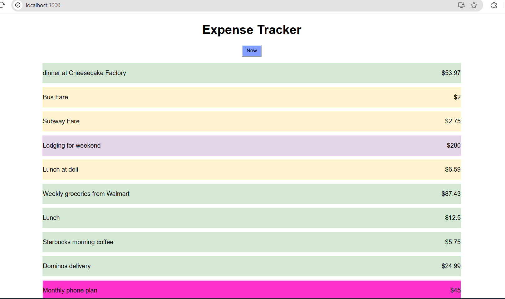

# Expense Tracker

A simple **Expense Tracker** built with **React, Java, and Spring Boot** that demonstrates building a full-stack application with a REST API and relational database.

---

## 🚀 Overview

The application allows users to record and view expenses through a web interface.
The React frontend communicates with a Spring Boot REST API that stores expense data in a MySQL database.

---

## 🛠️ Tech Stack

### Frontend

* React

### Backend

* Java
* Spring Boot
* Spring Data JPA
* REST APIs

### Database

* MySQL

---

## ✨ Features

* Add new expenses
* View all recorded expenses
* Retrieve expense records through REST API endpoints

---

## 📷 Screenshot



---

## ⚙️ Running the Project

### Clone the repository

```
git clone https://github.com/kayanr/ExpenseTracker.git
```

### Create database

```
CREATE DATABASE expense_tracker_db;
```

### Start the backend

```
mvn spring-boot:run
```

Backend runs at:

```
http://localhost:8080
```

### Start the frontend

```
cd frontend
npm install
npm start
```

Frontend runs at:

```
http://localhost:3000
```
